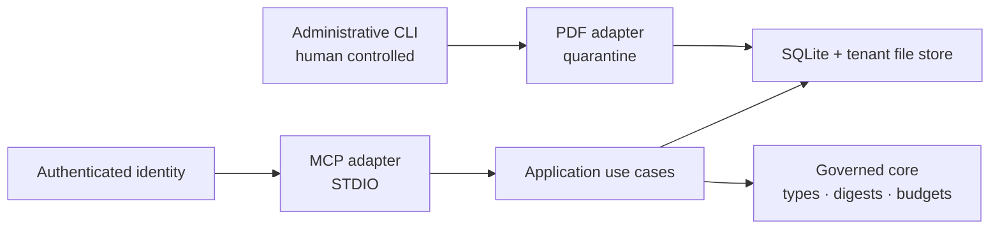

# Architecture

Compliatory uses a ports-and-adapters architecture with four explicit zones:

`compliatory-core` owns serialisable domain types and deterministic algorithms.
`compliatory-application` owns use cases and storage/authentication ports. Adapters implement those
ports but may not weaken their invariants. Composition roots select a tenant from authenticated
configuration before accepting any MCP request.

The local deployment uses SQLite plus a partitioned filesystem. A future hosted deployment can
replace those adapters with PostgreSQL and object storage without changing the MCP contract.
Regulatory writes are insert-only, differing content under an existing immutable key is refused, and
the schema evolves through numbered migrations
([ADR-007](adr/ADR-007-immutable-writes-and-schema-evolution.md)).

Content always has exactly one layer: `catalog`, `guidance`, `normative` or `tenant`. Only an
approved and entitled `normative` fragment may carry `exact_text`.
